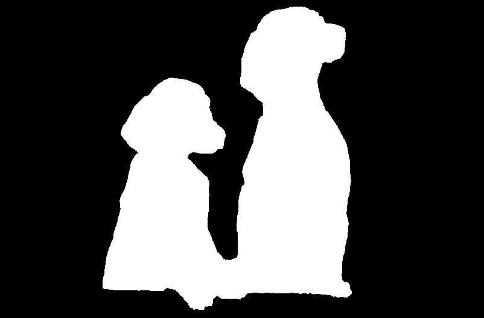

## Overview
The Image Cutout API is powered by Sensei, Adobe’s Artificial Intelligence Technology, and Photoshop. The API's can identify the main subject of an image and produce two types of outputs. You can create a greyscale [mask](https://en.wikipedia.org/wiki/Layers_(digital_image_editing)#Layer_mask) png file that you can composite onto the original image (or any other).  You can also create a cutout where the mask has already composited onto your original image so that everything except the main subject has been removed.

| Original        | Mask           | Cutout  |
| :-------------: |:-------------:| :-----:|
|  | | |

## General Workflow

The typical workflow involves making an API POST call to the endpoint https://image.adobe.io/sensei for which the response will contain a link to check the status of the asynchronous job. Making a GET call to this link will return the status of the job and, eventually, the links to your generated output.
