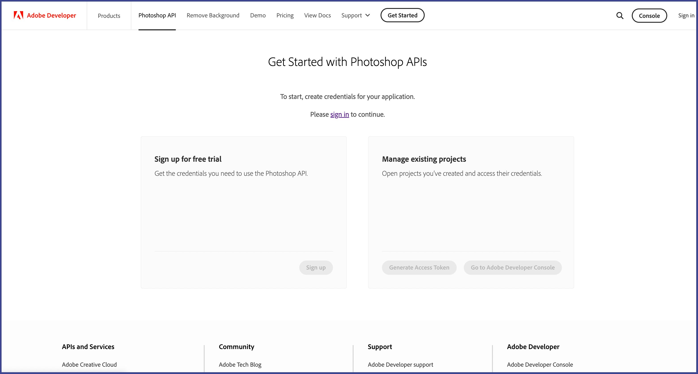
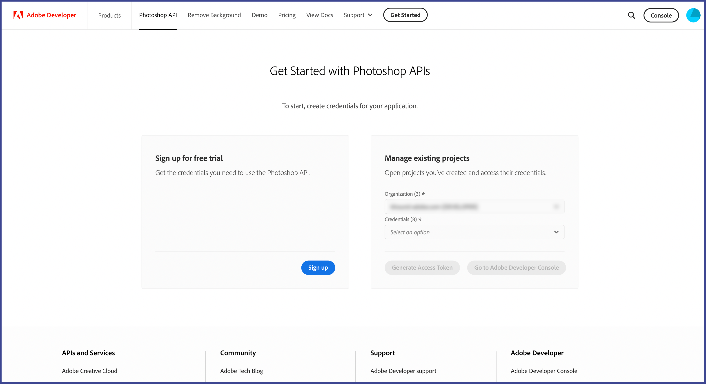
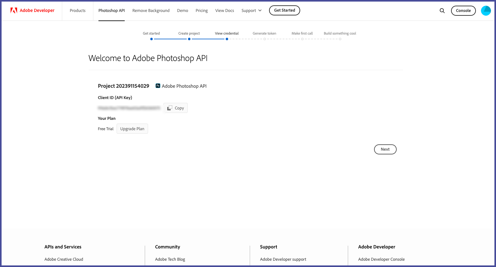
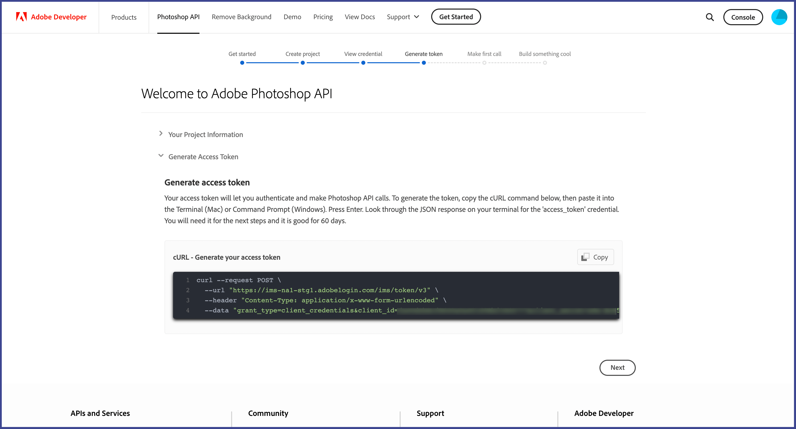
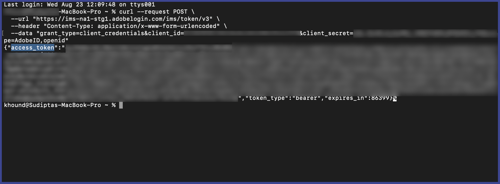
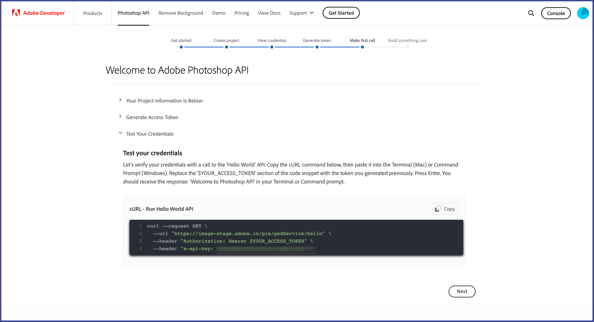
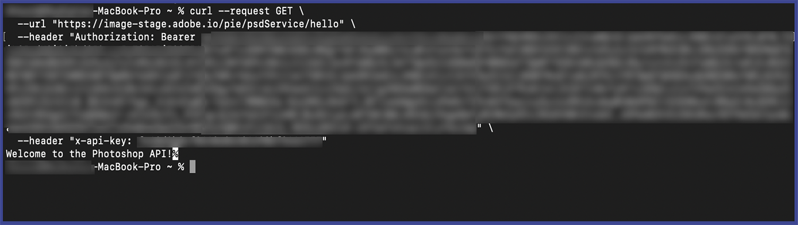
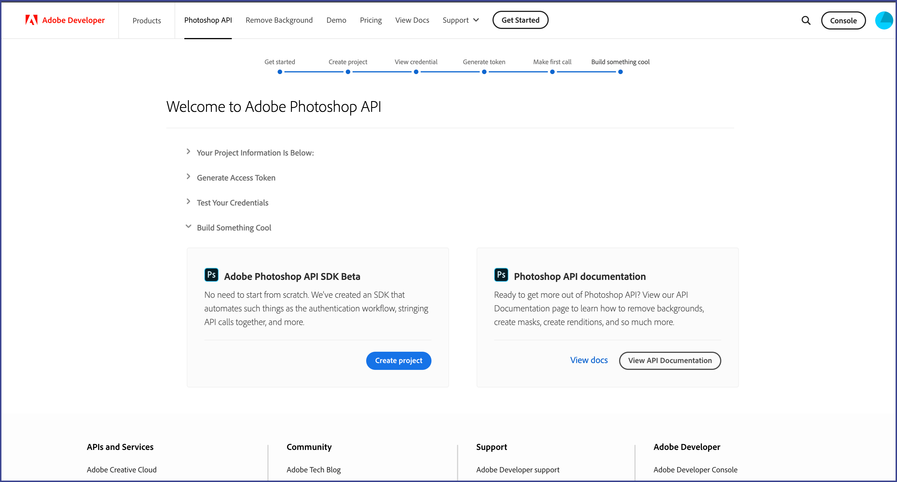
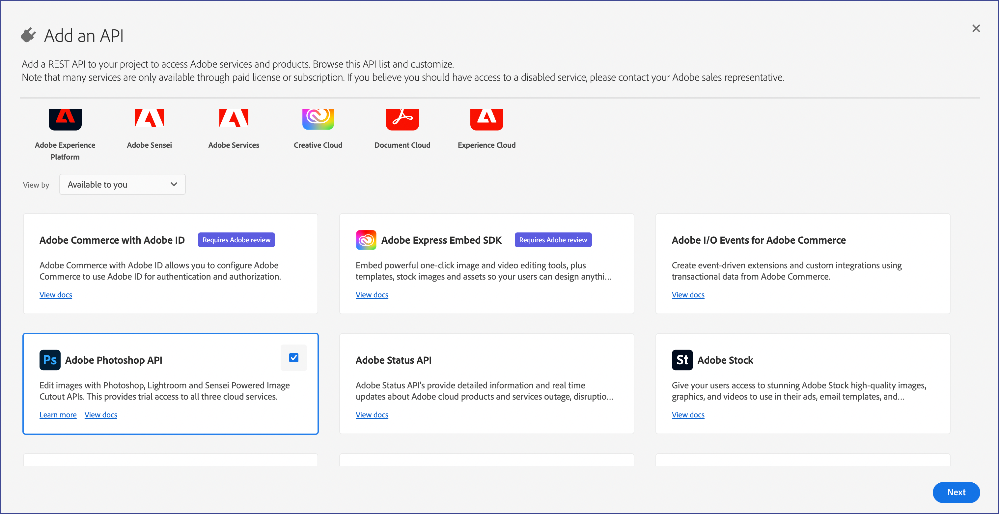

# Getting started with Photoshop API

To access the Photoshop APIs, you’ll need to be authenticated. For that, you’ll need an Authorization Token and an API Key. Follow the steps below to gain access and make your first `hello world` call.

## Get access
### Getting started from Photoshop API Get Started page

1. Go to https://developer.adobe.com/photoshop/api/signup/?ref=signup and sign in to your developer account


2. Sign up and follow the prompts.


3. A new project with Project Name and your Organization will be populated. Check the box to agree to the Adobe developer terms. Then, select Create credentials.
If you would like, you can edit the Project Name to enter a name of your choice.


4. You should end up on a screen similar to the picture below:


5. Congratulations! You have successfully created an Client ID(API Key). Now select Next to generate your access token.


6. To generate the token, copy the cURL command by clicking on the Copy button, then paste it into the Terminal (Mac) or Command Prompt (Windows). Press Enter. Look through the JSON response on your terminal for the 'access_token' credential. You’ll need it in the next step.


7. Let's verify your credentials with a call to the 'Hello World' API. Copy the cURL then paste it into the Terminal (Mac) or Command Prompt (Windows) and replace the '$YOUR_ACCESS_TOKEN' section of the code snippet with the token you generated previously.


8. You should receive the response 'Welcome to Photoshop API' in your Terminal or Command prompt.


9. Congratulations! You just made your first request to the Photoshop API.

10. Now select Next on the wizard to see the options to automate the token generation process and build your application using [Photoshop API SDK](https://github.com/adobe/adobe-photoshop-api-sdk) and explore our APIs by looking at the [Photoshop API Documentation](../api/)


### Getting started from Adobe I/O Console

You can also directly go to Adobe I/O Console to signup. This section is alternative to [Getting started from Photoshop API Get Started page](#getting-started-from-photoshop-api-get-started-page).
1. Go to https://developer.adobe.com/console/home and **sign in to the IO Console.**
2. Select **Create new project** under the **Quick start** section on the middle of your screen:

3. Choose **Add API**:

4. Select the **Adobe Photoshop API** and click on **Next**:

5. Select **Save configured API**:

Default selection for type of Authentication is made for **OAuth Server-to-Server** and you should keep it. Service Account(JWT) authentication will be deprecated soon.  
6. Select **Generate access token**:

7. Congratulations! You have just created a token. You can **copy** the token :

8. Once you’ve created your token, you can follow the steps below to make your first API call.
   - Open your terminal and paste the code below.
   - Replace the variables "YOUR_ACCESS_TOKEN" with the token you generated on Adobe I/O Console.
   - Replace <YOUR_CLIENT_ID>. You can find this on the same page you generated your token on.
   - Once all variables have been replaced you can run the command.

``` shell
curl --request GET \
  --url https://image.adobe.io/pie/psdService/hello \
  --header "Authorization: Bearer <YOUR_ACCESS_TOKEN>" \
  --header "x-api-key: <YOUR_CLIENT_ID>"
```

If you are using Windows machine don't use the backslash for the curl commands. e.g
``` shell
curl --request GET --url https://image.adobe.io/pie/psdService/hello --header "Authorization: Bearer <YOUR_ACCESS_TOKEN>" --header "x-api-key: <YOUR_CLIENT_ID>"
```
Congratulations! You just made your first request to the Photoshop API.

## Automate Token
Note that your token will expire every 60 minutes and will need to be refreshed after it expires. You can automate the token generation by referring to our sample code in node.js [here](https://github.com/AdobeDocs/cis-photoshop-api-docs/blob/main/sample-code/jwt-sample-app/index.js)

## Build something cool#
You have now Access Token and Client Id. You can use that to build your application using Photoshop API.
Check out this SDK and API documentation for that.
- [Photoshop API SDK](https://github.com/adobe/adobe-photoshop-api-sdk#readme)
- [Photoshop API Documentation](../api/)
