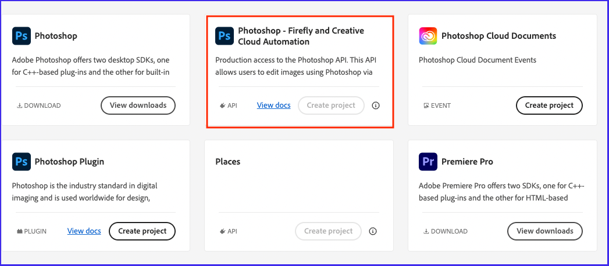
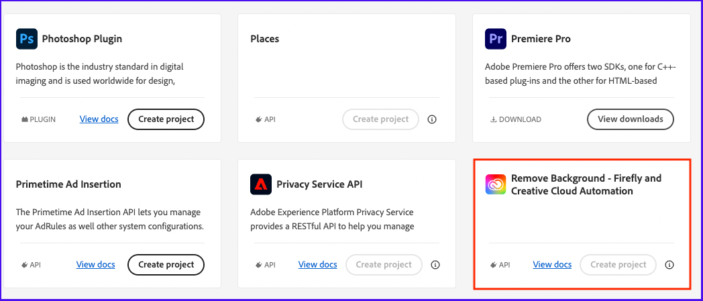

# Getting started with Photoshop and Lightroom API

The first step in accessing the Photoshop and Lightroom APIs is getting authenticated. For that you will need an Authorization Token and an API Key. With the steps below, we'll show you how to gain access and make your first `hello world` call.

## Get access

Here are the steps to get started with the Photoshop and Lightroom APIs.

### Getting started from Developer Console

 If you *have* already been provisioned with access through your organization you will need to create a project in developer console. If you have already got your API key, you can skip these steps.
1. Go to https://developer.adobe.com/console/home and **sign in to the Developer Console**.
2. Select **Create new project** under the **Quick start** section on the middle of your screen:

3. Choose **Add API**:

4. Select the **Photoshop - Firefly and Creative Cloud Automation** and click on **Next**:

5. Select **Save configured API**:

Default selection for type of Authentication is made for **OAuth Server-to-Server** and you should keep it. Service Account(JWT) authentication will be deprecated soon.
6. Add the Lightroom API to your project by clicking on **Add to Project** and selecting **API**

7. Select the **Lightroom - Firefly and Creative Cloud Automation** and click on **Next**:

Repeat step 5
8. Repeat step 6 and select **Remove Background - Firefly and Creative Cloud Automation** and click on **Next**:

Repeat step 5
9. Select **Generate access token**:

10. Congratulations! You have just created a token. You can **copy** the token :

11. Once you’ve created your token, you can follow the steps below to make your first API call.
   - Open your terminal and paste the code below.
   - Replace the variables "YOUR_ACCESS_TOKEN" with the token you generated on Adobe I/O Console.
   - Replace <YOUR_CLIENT_ID>. You can find this on the same page you generated your token on.
   - Once all variables have been replaced you can run the command.

``` shell
curl --request GET \
  --url https://image.adobe.io/pie/psdService/hello \
  --header "Authorization: Bearer <YOUR_ACCESS_TOKEN>" \
  --header "x-api-key: <YOUR_CLIENT_ID>"
```

If you are using Windows machine don't use the backslash for the curl commands. e.g
``` shell
curl --request GET --url https://image.adobe.io/pie/psdService/hello --header "Authorization: Bearer <YOUR_ACCESS_TOKEN>" --header "x-api-key: <YOUR_CLIENT_ID>"
```
Congratulations! You just made your first request to the Photoshop API.

## Automate Token
Note that your token will expire every 60 minutes and will need to be refreshed after it expires. You can automate the token generation by referring to our sample code in node.js [here](https://github.com/AdobeDocs/cis-photoshop-api-docs/blob/main/sample-code/service-principal-sample-app/index.js)

## Build something cool#
You have now Access Token and Client Id. You can use that to build your application using Photoshop API.
Check out this SDK and API documentation for that.
- [Photoshop API SDK](https://github.com/adobe/adobe-photoshop-api-sdk#readme)
- [Photoshop API Documentation](../api/)
