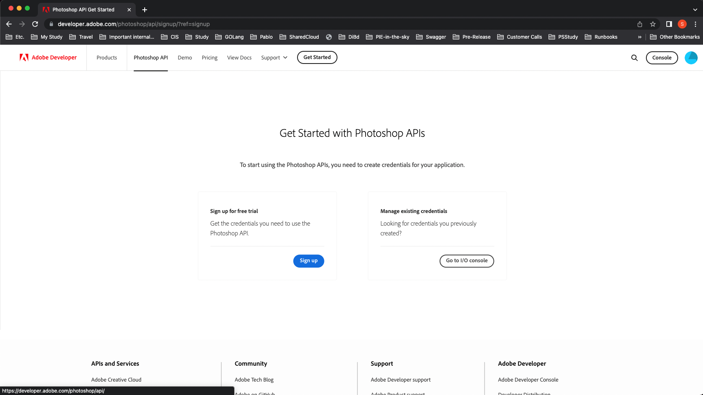
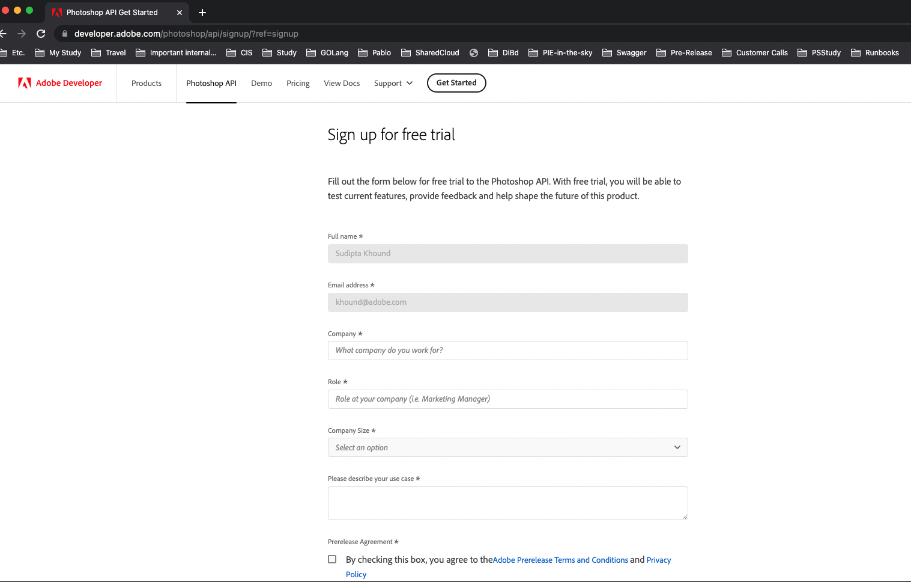
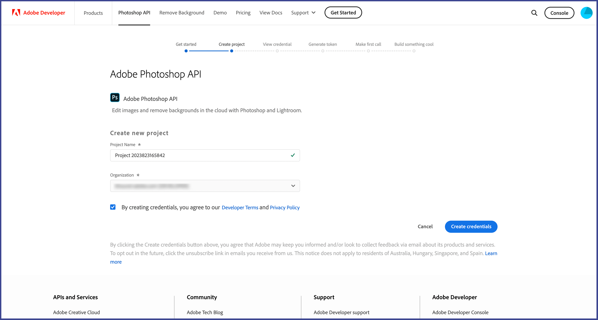
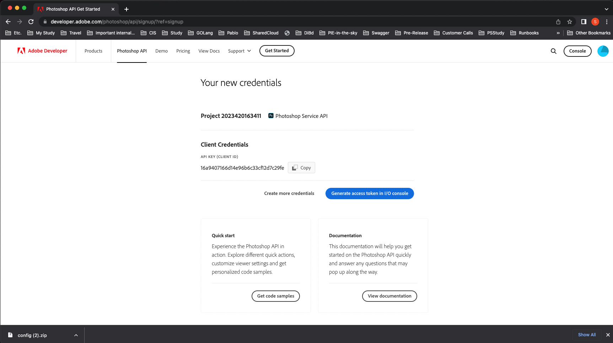
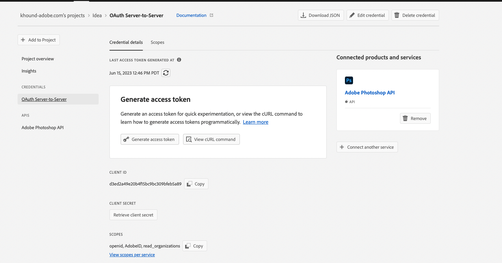
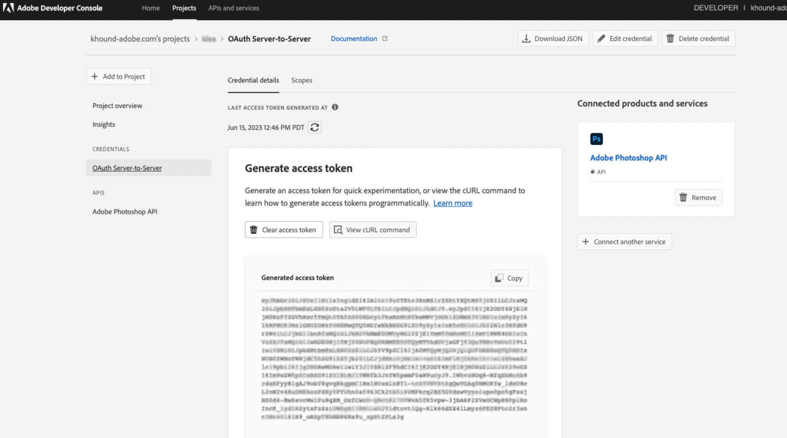
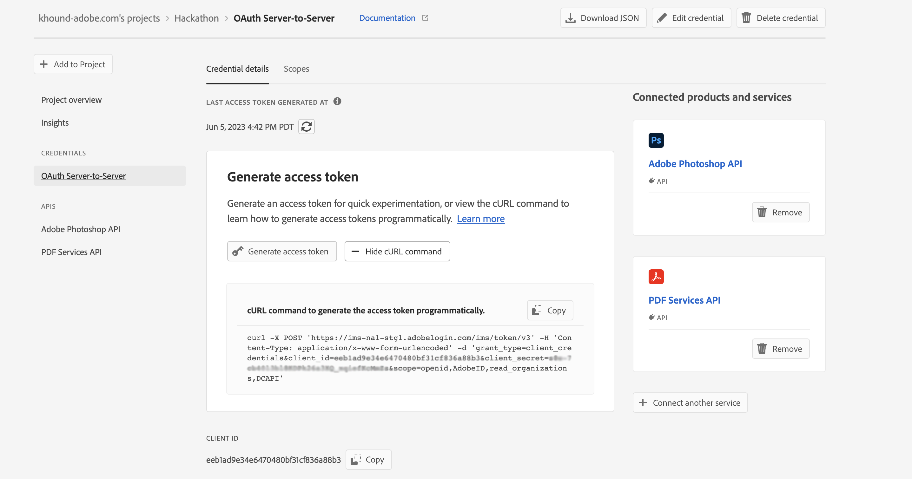
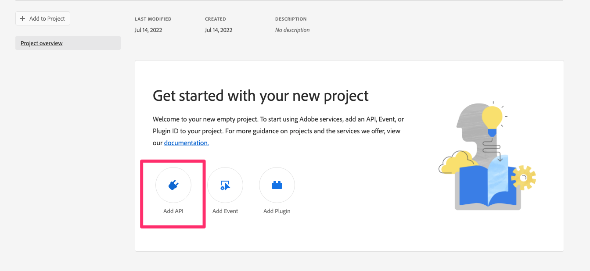
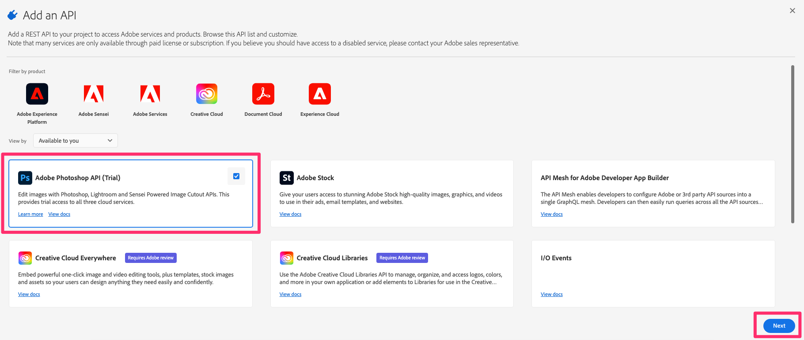

# Getting started with Photoshop API

The first step in accessing the Photoshop APIs is getting authenticated. For that you will need an Authorization Token and an API Key. With the steps below, we'll show you how to gain access and make your first `hello world` call.

## Get access
Here are the steps to get started with the Photoshop APIs.

1. Go to https://developer.adobe.com/photoshop/api/signup/?ref=signup.
1. Sign in to your adobe developer account.
1. Click on the blue "Sign up" button.


1. Fill the "Sign up for free trial" Form and Submit.


1. Enter a new project name and check the box to agree to the Adobe developer terms.
1. Click on the blue “Create credentials” button.


1. Click on the blue “Generate access token in I/O console” button.


1. You should end up on a screen similar to the picture below.


1. Click on "Generate access token" button.


1. Congrats! You have just created a token. You can copy the token by clicking the **Copy** button:

1. If you would like to generate token programmatically , you can click on "View cURL command" and copy the command.


1. You should end up on a screen similar to the picture below. You can now **Copy** the command.


Please note that token expires every 24 hours and you will have to generate a new one after it expires. See [Automating your JWT token](/authentication/#automating-your-jwt-token) for information on how to automate this process for your application.

## Hello World

Once you have created your token you can follow the steps below to make your first API call.

1. Open your terminal and paste the code below.
1. Replace the variables "YOUR_ACCESS_TOKEN"  with the token you generated on Adobe I/O Console.
1. Replace <YOUR_CLIENT_ID>. You can find this on the same page you generated your token on.
1. Once all variables have been replaced you can run the command.

``` shell
curl --request GET \
  --url https://image.adobe.io/pie/psdService/hello \
  --header "Authorization: Bearer <YOUR_ACCESS_TOKEN>" \
  --header "x-api-key: <YOUR_CLIENT_ID>"
  ```

If you are using Windows machine don't use the backslash for the curl commands. e.g
``` shell
curl --request GET --url https://image.adobe.io/pie/psdService/hello --header "Authorization: Bearer <YOUR_ACCESS_TOKEN>" --header "x-api-key: <YOUR_CLIENT_ID>"
```


Congrats! You just made your first request to the Photoshop API.

`NOTE: Your token will expire every 24 hours and will need to be refreshed after it expires. We recommend using our SDK to automate this process. See the next section for more information on your automation options.`

## Getting started from Adobe I/O Console
You can also directly go to Adobe I/O Console to signup. This section is alternative to [Get access](#get-access), if you **have** already signed up.
1. Go to https://developer.adobe.com/console/home and **sign in to the IO Console.**
1. Click on **Create new project** under the **Quick start** section on the middle of your screen:

1. Click on **Add API**:

1. Select the **Adobe Photoshop APIs (Trial)** and click on **Next**:

1. Click on **Save configured API**:

Default selection for type of Authentication is made for **OAuth Server-to-Server** and you should keep it. Service Account(JWT) authentication will be deprecated soon.  
1. Click on **Generate access token**:

1. Congrats! You have just created a token. You can **copy** the token :


## Automating your token generation#

Check out these modules for a quick path to automating your token retrieval:
- [Photoshop API SDK](https://github.com/adobe/adobe-photoshop-api-sdk)
- [Sample App](https://github.com/AdobeDocs/cis-photoshop-api-docs/tree/main/sample-code/jwt-sample-app) with an example of a call to Photoshop API. The token is generated programmatically in this app. You can follow Step 11 [here](./getting-started/#get-access) to generate an access token programmatically for your integration.

## Additional Information

You can find details on interacting with Adobe's authentication in general
[General Authentication Information](https://www.adobe.io/authentication/auth-methods.html#!AdobeDocs/adobeio-auth/master/AuthenticationOverview/AuthenticationGuide.md)
