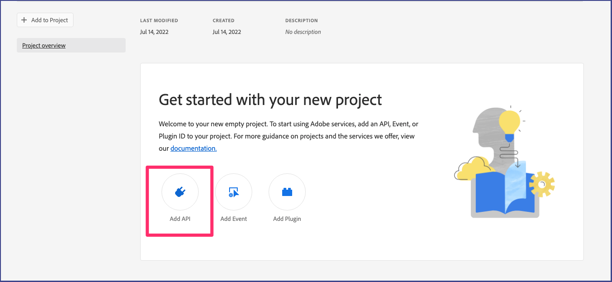

# Getting started with Lightroom API

The first step in accessing the Lightroom API is making sure your organization is provisioned with access to Firefly Services. Once you have confirmed your have access you will need to create a project in the Adobe Developer Console and obtain a set of credentials. Follow the guide below create a project and make your first `hello world` call.

### Getting started from the Adobe Developer Console

 After you have confirmed you have access to Firefly Services you will need to create a project in the Adobe Developer Console. If you have already obtained a set of credentials you can skip these steps.

1. Go to https://developer.adobe.com/console/home and **sign in to the Developer Console**.

2. Select **Create new project** under the **Quick start** section on the middle of your screen:


3. Choose **Add API**:


4. Select the **Lightroom - Firefly Services ** and click on **Next**:


5. Select **Save configured API**:

The **OAuth Server-to-Server** authentication method is selected by default. This is the recommended authentication method as the JWT method will be deprecated soon.

6. Add the Lightroom API to your project by clicking on **Add to Project** and selecting **API**


7. Select **Generate access token**:


8. Congratulations! You have just created a token. You can **copy** the token :


9. Once you’ve created your token, you can follow the steps below to make your first API call.
   - Open your terminal and paste the code below.
   - Replace the variables "YOUR_ACCESS_TOKEN" with the token you generated on Adobe I/O Console.
   - Replace <YOUR_CLIENT_ID>. You can find this on the same page you generated your token on.
   - Once all variables have been replaced you can run the command.

``` shell
curl --request GET \
  --url https://image.adobe.io/pie/psdService/hello \
  --header "Authorization: Bearer <YOUR_ACCESS_TOKEN>" \
  --header "x-api-key: <YOUR_CLIENT_ID>"
```

If you are using Windows machine don't use the backslash for the curl commands. e.g
``` shell
curl --request GET --url https://image.adobe.io/pie/psdService/hello --header "Authorization: Bearer <YOUR_ACCESS_TOKEN>" --header "x-api-key: <YOUR_CLIENT_ID>"
```
Congratulations! You just made your first request to the Photoshop API.

## Build something cool
Once you've acquired your credentials and Access Token, you're ready to utilize them for building your application with the Lightroom API. Explore our SDK and API Reference for further guidance.
- [Firefly Services SDK](https://github.com/Firefly-Services)
- [Lightroom API Reference](../api/)
